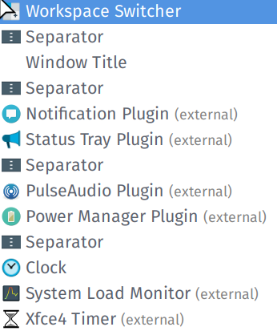

# Installing i3wm with XFCE4

1. Follow this tuto: [feeblenerd](https://feeblenerd.blogspot.com/2015/11/pretty-i3-with-xfce.html) but **skip** section V and IX.

2. Custom [i3wm config](.config/i3/config) based on: [addy-dclxvi/i3-starterpack](https://github.com/addy-dclxvi/i3-starterpack).

3. Custom xfce4-panel:

[xfce4-panel illustration](xfce4-panel-illustration.png)

The only non default item is [xfce4-wintitle-plugin](https://github.com/AdamYuan/xfce4-wintitle-plugin)

The clock is displayed with the `%F %a %R` format.

The style of the panel is defined in the [gtk.css](.config/gtk-3.0/gtk.css) file.

The panel configuration is defined in [xfce4-panel-config.txt](xfce4-panel-config.txt) and can be loaded via the [xfce4-panel-profiles](https://docs.xfce.org/apps/xfce4-panel-profiles/start#examples) command.

4. Install [Picom](https://github.com/yshui/picom) and use the following [config file](.config/picom/picom.conf).

5. Uninstall `dunst` to use `xfce4-notifyd`.

6. Rofi [config file](.config/rofi/config) tweaked from [adi1090x's rofi scripts](https://github.com/adi1090x/rofi).

# Custom i3wm bindings

| Binding        | Command         |
|----------------|-----------------|
| Super+²      | Mutes sound  |
| Super+e        | `emacs`           |
| Super+w        | `firefox`         |
| Alt+Ctrl+Shift+Right | [`go_empty.sh`](.config/i3/go_empty.sh)     |
| Alt+left       | [`move.sh -1`](.config/i3/move.sh) |
| Alt+right      | [`move.sh 1`](.config/i3/move.sh)  |
| Alt+Space      | `rofi`            |
| Super+f        | `thunar`          |
| Super+Shift+q   | `xfce4-session-logout`  |
| Super+Return   | `xfce4-terminal`  |
