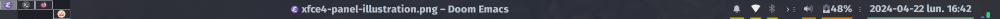

1. Follow this tuto: [feeblenerd](https://feeblenerd.blogspot.com/2015/11/pretty-i3-with-xfce.html) but **skip** section V and IX.

2. Custom [i3wm config](.config/i3/config) based on: [addy-dclxvi/i3-starterpack](https://github.com/addy-dclxvi/i3-starterpack).

3. Custom xfce4-panel.

The only non default item is [xfce4-windowck-plugin](https://github.com/cedl38/xfce4-windowck-plugin) used to have the focused window title in the panel.

The clock is display with the `%R` format.

The style of the panel is defined in the [gtk.css](.configure/gtk-3.0/gtk.css) file.

4. Compton [config file](.config/.compton.conf) to have opacity support for xfce4-notifyd.

5. Rofi [config file](.config/rofi/config).

## Custom i3wm bindings

| Binding   | Command         |
|-----------|-----------------|
| Alt+Space | `rofi`            |
| Alt+t     | [`xfce4-dict`](.config/rofi/trad.sh)      |
| Alt+f     | [`catfish`](.config/rofi/srch.sh)         |
| Super+w   | `firefox`         |
| Super+f   | `thunar`          |
| Super+e   | `emacs`           |
| Alt+left  | [`move_next.sh -1`](.config/i3/move_next.sh) |
| Alt+right | [`move_next.sh 1`](.config/i3/move_next.sh)  |
| Alt+down  | [`move_last.sh`](.config/i3/move_last.sh)    |

